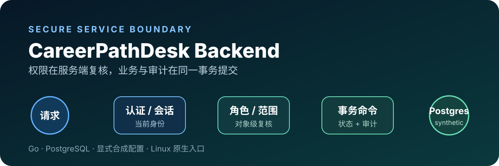

<p align="center">
  
</p>

<p align="center">
  Go · PostgreSQL · Docker Compose · 合成数据优先
</p>

<p align="center">
  <a href="https://confidence-huang.github.io/careerpathdesk-website/">项目官网</a> ·
  <a href="https://github.com/Confidence-huang/careerpathdesk-frontend">产品前端</a>
</p>

# CareerPathDesk Backend

> 把身份、对象范围、业务写入和最小审计证据放在同一个服务边界中。

## 先看请求如何落库

```text
HTTP 请求
  → 账号与会话复核
  → 当前角色 / 学生范围复核
  → 短事务执行业务命令
  → 同事务写入最小审计事实
  → PostgreSQL
```

后端不会因为前端隐藏了按钮就跳过服务端复核。主要模块包括账号与 MFA、学生档案、跟进、邀请、测评、关注事项、隐私请求、数据导出、留存和团队计划。

## 设计边界

| 边界 | 约束 |
| --- | --- |
| 数据库 | 所有本地入口必须显式声明 `synthetic`，无默认生产连接 |
| 密钥 | 由脚本生成到 Git 忽略的 `.runtime/`，配置文件只保存路径 |
| 权限 | 每个命令重新核验当前账号、会话和对象范围 |
| 原子性 | 业务状态与必要审计事实共享事务提交 |
| 学生入口 | 依赖一次性邀请与受限会话，不复用员工工作台权限 |
| 日志 | 输出稳定事件分类，不记录密码、令牌或业务行内容 |

## 本地快速验证

需要 Go 1.26.6+、Docker 与 Docker Compose。默认只创建名为 `careerpathdesk-synthetic` 的本地资源。

```bash
git clone https://github.com/Confidence-huang/careerpathdesk-backend.git
cd careerpathdesk-backend
make verify
make db-down
```

`make verify` 会准备合成运行时，启动隔离的 PostgreSQL，运行 Go 测试、静态检查、构建和 Compose 配置检查。若只想分步执行，可查看 [Makefile](./Makefile) 中的 `prepare`、`db-up`、`test`、`vet` 和 `build` 目标。

## 目录

```text
cmd/                 # API、迁移、合成 seed 与受控运维入口
internal/            # 业务模块与平台能力
database/migrations/ # 编号、校验和受控的 schema 演进
database/seeds/      # 唯一公开合成数据包
deploy/docker/       # 命名隔离的本地 PostgreSQL
scripts/             # Linux 原生准备与显式环境包装器
tests/performance/   # 合成规模与 P95 行为验证
```

## 配置原则

从 [`.env.example`](./.env.example) 理解配置项，但不要把它复制成已提交的真实配置。密码、Ed25519 私钥和合成账号口令由 `scripts/prepare-synthetic.sh` 单独生成，脚本不会打印其内容。

## 公共仓库边界

这里只保留源代码、迁移和合成 seed。生产域名、真实学生数据、备份、运行时密钥、内部日志与发布目录均不在公共历史中。生产使用者必须自行完成威胁建模、数据保护、密钥托管、监控与恢复演练。

## 许可证

采用 [GNU Affero General Public License v3.0](./LICENSE)。通过网络提供修改后的服务时，请向相应用户提供对应源代码。
